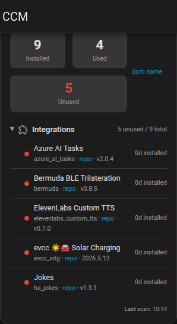
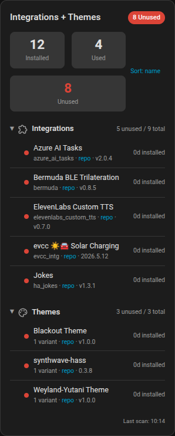
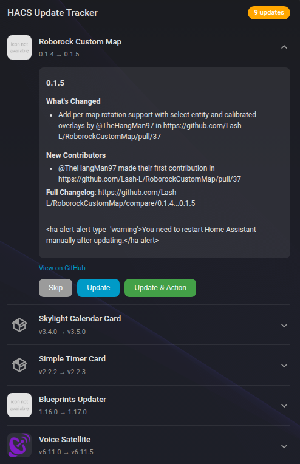
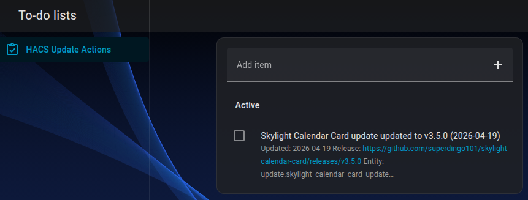
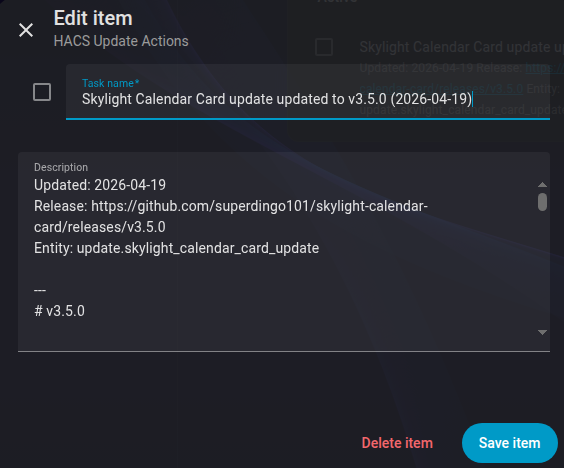

# Home Assistant Custom Component Monitor

[](https://github.com/custom-components/hacs)
[](https://github.com/loryanstrant/HA-CustomComponentMonitor/releases/)

A Home Assistant custom integration that monitors your HACS installation for unused custom components, themes, and frontend resources — and now also helps you manage HACS updates that need follow-up action.

<p align="center"></p>

## Overview

Home Assistant allows the installation of custom components such as dashboards/cards, themes, and integrations via the Home Assistant Community Store (HACS). Many of these are left unused over time, and HACS updates can include release notes, breaking changes, or new features that you want to review later.

**Custom Component Monitor** creates sensors that list all HACS-installed custom components and identifies whether they are actually being used (configured integrations, active themes, referenced frontend resources). It includes a custom Lovelace card to visualise everything at a glance.

From v1.3.0, it also includes the former **HACS Update Action Tracker** functionality under the same `custom_component_monitor` domain. One integration now provides:

- the Custom Component Monitor dashboard card
- the HACS Update Action Tracker dashboard card
- a persistent `todo.hacs_update_actions` to-do list
- the `custom_component_monitor.update_and_action` service

## Screenshots

### Custom Component Monitor card

The CCM card supports section filtering. Summary totals are calculated from the sections selected in that specific card, so an integrations-only card shows integration totals rather than the global HACS total.

**Integrations only**



**Integrations + themes**



### HACS Update Action Tracker card

Screenshots below are from the original Update Action Tracker repository and show the card, generated to-do item, and to-do item details.

**List of components to update**



**Item added to to-do list**



**To-do item details**



## Features

### Custom Component Monitor

- 🔍 **HACS Discovery**: Scans your HACS repositories for all installed custom components
- 📊 **Usage Analysis**: Determines which custom components are actually being used
  - **Integrations**: Checks `core.config_entries` for configured HACS domains
  - **Themes**: Scans Lovelace dashboard configs and HA theme settings for active themes
  - **Frontend Cards**: Matches `custom:` card types in dashboards against installed HACS plugins
- 🃏 **Dashboard Card**: Built-in Lovelace card with collapsible sections, sort options, and section filtering
- 🧮 **Section-aware Summary Totals**: Installed, used, and unused counts are calculated from the selected card sections
- 🏷️ **Repository Links**: Direct links to each component's repository
- 📅 **Installation Tracking**: Shows how long each component has been installed
- ⚡ **Real-time Updates**: Hourly scans to reflect configuration changes

### HACS Update Action Tracker

- 📋 **Smart Update Card**: Lists pending HACS integration updates with Skip, Update, and Update & Action buttons
- 📝 **Expandable Release Notes**: Fetches release notes directly from Home Assistant update entities
- 🔗 **Release Links**: Links to the GitHub release page when provided by the update entity
- 🔄 **Real-time Progress Tracking**: Shows installation progress and disables action buttons during active updates
- ✅ **Todo List Integration**: Update & Action installs the update and creates a to-do item with release notes
- 🎨 **Polished UI**: Includes a visual editor for the update card title and matches your Home Assistant theme

## Installation

### HACS (Recommended)

1. Open HACS in your Home Assistant instance
2. Go to **Integrations**
3. Click the three dots menu and select **Custom repositories**
4. Add `https://github.com/loryanstrant/HA-CustomComponentMonitor` as repository
5. Set category to **Integration**
6. Click **Add**
7. Find **Custom Component Monitor** in the integration list and install it
8. Restart Home Assistant
9. Go to **Settings → Devices & services**
10. Click **+ Add Integration** and search for **Custom Component Monitor**
11. Press **Submit** to complete the installation
12. Restart Home Assistant again so both Lovelace cards are copied and registered
13. Force refresh your browser if the cards do not appear immediately

Or replace steps 1–6 with this:

[](https://my.home-assistant.io/redirect/hacs_repository/?owner=loryanstrant&repository=HA-CustomComponentMonitor&category=integration)

### Manual Installation

1. Download the latest release from the [releases page](https://github.com/loryanstrant/HA-CustomComponentMonitor/releases)
2. Extract the contents
3. Copy the `custom_components/custom_component_monitor` directory to your Home Assistant `custom_components` directory
4. Restart Home Assistant
5. Add the integration via **Settings → Devices & services**
6. Restart Home Assistant again so both card resources are staged and registered

## Entities

The integration creates four sensors and one to-do entity:

| Entity | Description |
|--------|-------------|
| `sensor.hacs_installed_components` | Total count of all HACS-installed components with full metadata |
| `sensor.unused_custom_integrations` | Count and details of unused custom integrations |
| `sensor.unused_custom_themes` | Count and details of unused custom themes |
| `sensor.unused_frontend_resources` | Count and details of unused frontend cards/plugins |
| `todo.hacs_update_actions` | Persistent to-do list for HACS updates installed with follow-up actions |

### Sensor Attributes

Each unused sensor provides:

- `total_components` — total installed in that category
- `used_components` — count of components in active use
- `unused_components` — list of unused items with name, version, repository URL, days installed, and category-specific metadata (domain, card type, theme variants)

### To-do Entity

The `todo.hacs_update_actions` entity supports:

- creating items manually or via the `update_and_action` service
- updating item status when you've reviewed changes
- deleting items
- viewing descriptions with release notes

Items persist across Home Assistant restarts using local storage.

## Dashboard Cards

The integration automatically registers two Lovelace cards:

| Card type | Purpose |
|-----------|---------|
| `custom:custom-component-monitor-card` | Shows installed/used/unused HACS components by category |
| `custom:update-action-tracker-card` | Shows pending HACS updates with Skip, Update, and Update & Action buttons |

### Custom Component Monitor Card

#### Via UI

1. Edit a dashboard → **Add Card**
2. Search for **Custom Component Monitor**
3. Configure title, sort order, and visible sections

#### Via YAML

```yaml
type: custom:custom-component-monitor-card
title: Custom Component Monitor
```

#### Card Configuration

| Option | Type | Default | Description |
|--------|------|---------|-------------|
| `title` | string | `Custom Component Monitor` | Card title |
| `sort` | string | `name` | Default sort order: `name` or `days` |
| `sections` | list | `["integrations", "themes", "frontend"]` | Which sections to display |

#### Examples

**Show everything (default):**

```yaml
type: custom:custom-component-monitor-card
title: Unused Components
```

**Only unused integrations:**

```yaml
type: custom:custom-component-monitor-card
title: Integrations
sections:
  - integrations
```

**Integrations and themes:**

```yaml
type: custom:custom-component-monitor-card
title: Integrations + Themes
sections:
  - integrations
  - themes
```

**Themes and frontend, sorted by days installed:**

```yaml
type: custom:custom-component-monitor-card
title: Themes & Cards
sort: days
sections:
  - themes
  - frontend
```

#### Card Features

- **Summary bar** showing installed / used / unused counts for the selected sections only
- **Collapsible sections** that remember their open/closed state
- **Sort toggle** to switch between alphabetical and days-installed ordering
- **Section filtering** to show only the categories you care about
- **Repository links** for each unused component
- **Visual config editor** for all options

### HACS Update Action Tracker Card

#### Via UI

1. Edit a dashboard → **Add Card**
2. Search for **HACS Update Action Tracker**
3. Optionally customise the title
4. Save

#### Via YAML

```yaml
type: custom:update-action-tracker-card
title: HACS Update Tracker
```

#### Card Configuration

| Option | Type | Default | Description |
|--------|------|---------|-------------|
| `title` | string | `HACS Update Tracker` | Card title |

#### Card Features

- Lists pending HACS integration updates
- Shows component icon, current version, and available version
- Provides **Skip**, **Update**, and **Update & Action** buttons
- Displays a pending count badge, or **Up to date** when clear
- Fetches and renders release notes with basic Markdown support
- Shows progress while updates are installing

## Services

### `custom_component_monitor.scan_now`

Triggers an immediate scan of all HACS-installed custom components.

### `custom_component_monitor.update_and_action`

Installs a HACS update and creates a to-do item to track follow-up actions.

| Parameter | Required | Description |
|-----------|----------|-------------|
| `entity_id` | Yes | The update entity to install, for example `update.my_integration_update` |
| `version` | No | Specific version to install. If omitted, installs the latest version |

The to-do item created includes:

- **Summary**: `{Integration name} updated to {version} ({date})`
- **Description**: Update date, release URL, entity reference, and full release notes when available

Example service call:

```yaml
service: custom_component_monitor.update_and_action
data:
  entity_id: update.my_integration_update
```

## Migration from HACS Update Action Tracker

Update Action Tracker functionality is now built into Custom Component Monitor under the `custom_component_monitor` domain.

If you previously used the separate Update Action Tracker integration:

1. Install or update **Custom Component Monitor** to v1.3.0 or later
2. Add the **Custom Component Monitor** integration if it is not already configured
3. Replace old card YAML with:

   ```yaml
   type: custom:update-action-tracker-card
   title: HACS Update Tracker
   ```

4. Replace service calls from `update_action_tracker.update_and_action` to `custom_component_monitor.update_and_action`
5. Confirm the to-do entity is `todo.hacs_update_actions`
6. Remove the old `update_action_tracker` custom integration once you have migrated dashboard cards and automations

## How Detection Works

### Integrations

Compares HACS-installed integration domains against `core.config_entries`. If a domain has no config entry, it's marked unused.

### Themes

Scans all Lovelace dashboard configurations and the system/user theme settings for theme name references. Includes fuzzy matching to handle naming variations (e.g. `ha-transformers-theme` → `transformers-themes`).

### Frontend Cards

Derives expected `custom:` card type names from HACS plugin JS filenames, then searches all Lovelace dashboards for matching `type: custom:xxx` references. Utility plugins like `card-mod` are special-cased.

### HACS Updates

The update card looks for pending `update.*` entities provided by HACS. For **Update & Action**, it calls Home Assistant's `update.install` service and then creates a persistent item in `todo.hacs_update_actions` with release context and release notes when available.

## Contributing

Contributions are welcome! Please feel free to submit a Pull Request.

## Development Approach


## License

This project is licensed under the MIT License - see the [LICENSE](LICENSE) file for details.

## Support

If you encounter any issues, please report them on the [GitHub Issues page](https://github.com/loryanstrant/HA-CustomComponentMonitor/issues).
